# 🛒 Spring Boot E-Commerce Microservices

> A backend-only E-Commerce platform built using Spring Boot
> Microservices with Spring Cloud Gateway, Eureka Service Discovery, JWT
> Authentication, OpenFeign, Apache Kafka, and MySQL.

## 📑 Table of Contents

- Overview
- Key Features
- Architecture
- Technology Stack
- Project Structure
- Microservices
- Communication
- Project Demonstration
- Running the Project
- Configuration
- Testing
- Future Improvements
- Author
- License

## Badges

 


## 🚀 Project Highlights

- 7 Spring Boot Microservices
- JWT Authentication & Authorization
- Spring Cloud Gateway
- Eureka Service Discovery
- OpenFeign Inter-Service Communication
- Apache Kafka Event Messaging
- MySQL with Spring Data JPA
- Swagger / OpenAPI Documentation
- Global Exception Handling
- Unit & Repository Testing

------------------------------------------------------------------------

# Overview

This project is a backend-only E-Commerce application built using a microservices architecture with Spring Boot and Spring Cloud. It demonstrates secure authentication using JWT, synchronous inter-service communication with OpenFeign, asynchronous event-driven messaging using Apache Kafka, centralized routing through Spring Cloud Gateway, and service discovery with Eureka.

Major concepts demonstrated:

-   Spring Boot Microservices
-   Spring Cloud Gateway
-   Eureka Service Discovery
-   Spring Security + JWT
-   OpenFeign
-   Apache Kafka
-   Spring Data JPA
-   MySQL
-   Swagger / OpenAPI
-   Layered Architecture

------------------------------------------------------------------------

# Key Features

## Authentication

-   User Registration
-   Secure Login
-   JWT Token Generation
-   Spring Security

## Item Service

-   CRUD Operations
-   Validation
-   REST APIs

## Inventory Service

-   Inventory Management
-   Stock Updates

## Order Service

-   Place Orders
-   Communicates with Item & Inventory services
-   Publishes Kafka events

## Notification Service

-   Kafka Consumer
-   Processes low-stock/order notifications

## Infrastructure

-   API Gateway
-   Eureka Service Discovery
-   OpenFeign
-   Swagger Documentation
-   Global Exception Handling

------------------------------------------------------------------------

# Architecture

``` text
                                    Client
                                      │
                     ┌────────────────┴────────────────┐
                     │                                 │
                     ▼                                 ▼
          API Gateway Service              Direct Service Access
                     │
                     ▼
          ┌───────────────────────────────┐
          │     Authentication Layer      │
          │ (JWT Authentication Service)  │
          └───────────────────────────────┘
                     │
     ┌───────────────┼───────────────────────────────┐
     │               │                               │
     ▼               ▼                               ▼
 Item Service ◄────► Inventory Service ◄────► Order Service
        ▲                 │                    ▲
        │                 │                    │
        └─────────────────┴──── OpenFeign ────┘
                          │
                          │ Low Stock Event
                          ▼
                    Apache Kafka
                          │
                          ▼
              Notification Service

─────────────────────────────────────────────────────────────
      All services register with Eureka Server
      Each service maintains its own MySQL database
```

------------------------------------------------------------------------

# Technology Stack

Category        Technologies
  --------------- ---------------------------
Language        Java 17
Framework       Spring Boot, Spring Cloud
Security        Spring Security, JWT
Messaging       Apache Kafka
Discovery       Eureka
Communication   OpenFeign
Database        MySQL, JPA, Hibernate
Documentation   Swagger/OpenAPI
Build Tool      Maven
Testing         JUnit 5, Mockito

------------------------------------------------------------------------

# Project Structure

``` text
springboot-ecommerce-microservices/
├── authentication-service
├── gateway-service
├── eureka-service
├── item-service
├── inventory-service
├── order-service
├── notification-service
├── screenshots
├── README.md
├── LICENSE
└── .gitignore
```

------------------------------------------------------------------------

# Microservices

## Authentication Service

Handles user registration, login and JWT token generation.

## API Gateway

Acts as the single entry point for all client requests and routes them
to the appropriate services.

## Eureka Server

Provides service registration and discovery.

## Item Service

Manages product information through REST APIs.

## Inventory Service

Maintains stock availability and inventory updates.

## Order Service

Processes orders, validates inventory and publishes Kafka events.

## Notification Service

Consumes Kafka messages and generates notifications.

------------------------------------------------------------------------

# Communication

**Synchronous**

Client → Gateway → Services (REST/OpenFeign)

**Asynchronous**

Order Service → Kafka → Notification Service

------------------------------------------------------------------------

# Project Demonstration

The following screenshots demonstrate the architecture, API documentation, authentication flow, and event-driven communication implemented in this project.

---

## 1. Eureka Dashboard

The Eureka Server showing all registered microservices.

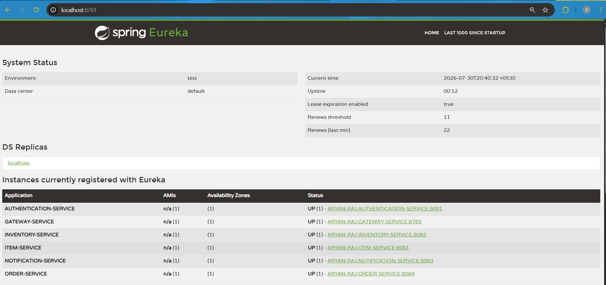

---

## 2. API Gateway Swagger

Centralized Swagger UI exposed through the API Gateway.

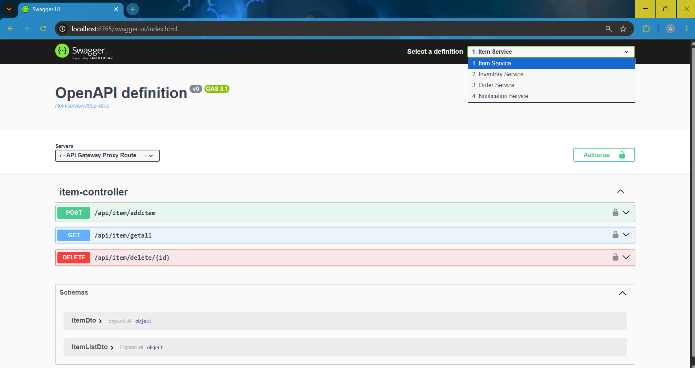

---

## 3. Authentication - User Registration

Registering a new user using the Authentication Service.

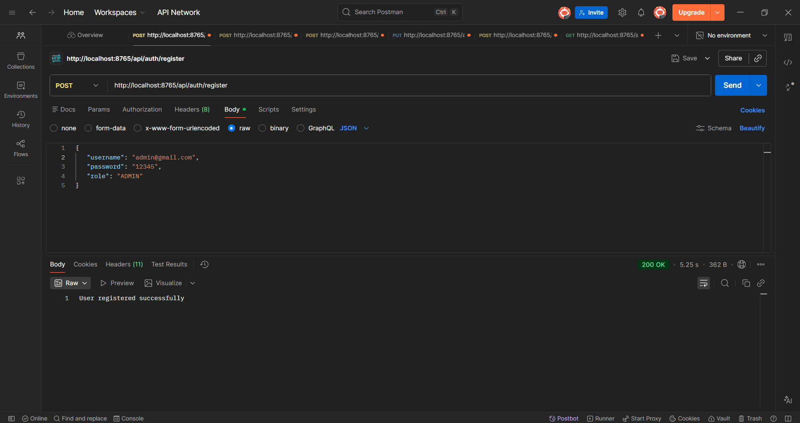

---

## 4. Authentication - User Login

Successful login returning a JWT access token.

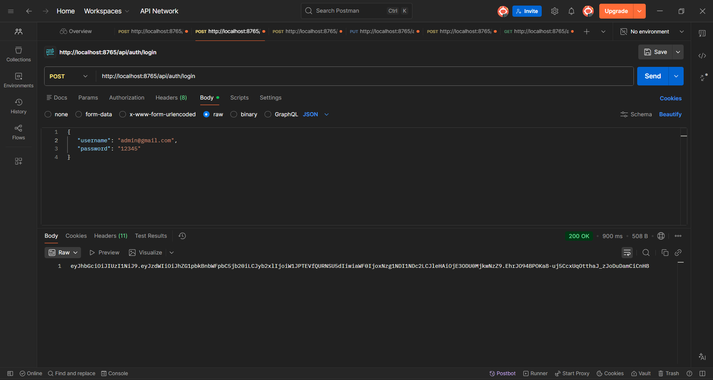

---

## 5. Item Service APIs

Swagger documentation for the Item Service.

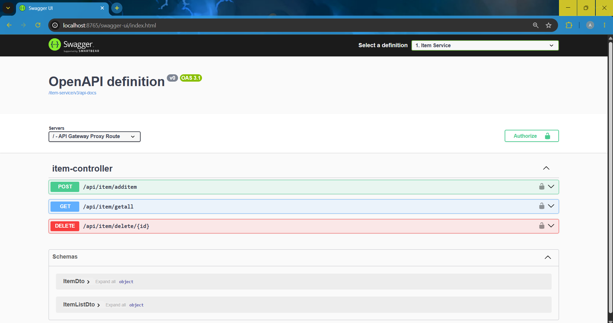

---

## 6. Inventory Service APIs

Swagger documentation for the Inventory Service.

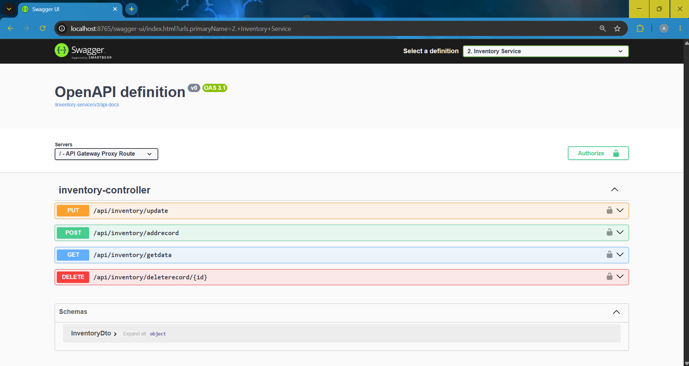

---

## 7. Order Service APIs

Swagger documentation for the Order Service.

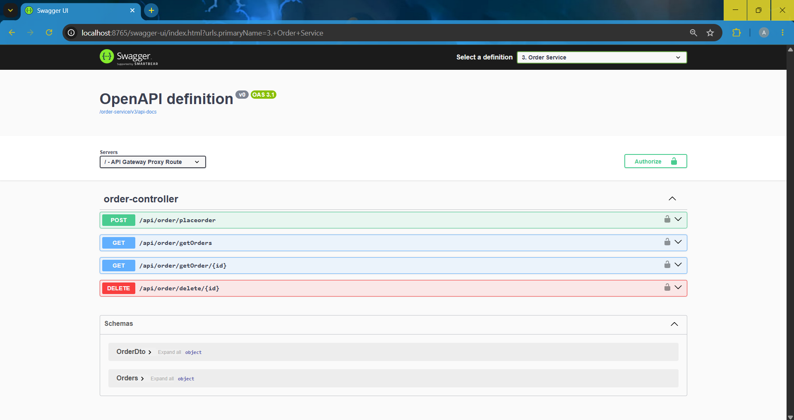

---

## 8. Notification Service APIs

Swagger documentation for the Notification Service.

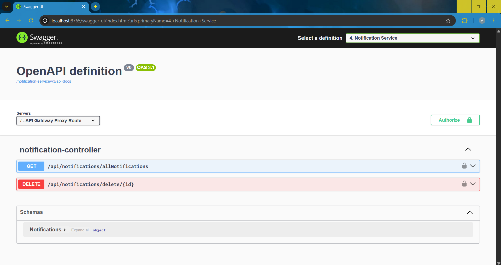

---

## 9. Order API Test

Creating an order using the REST API.

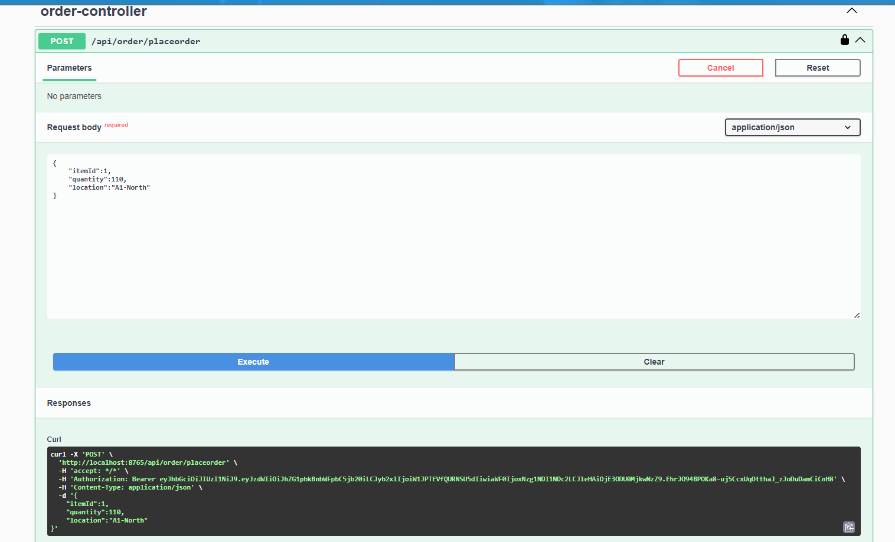

---

## 10. Order API Response

Successful order creation and response returned by the Order Service.

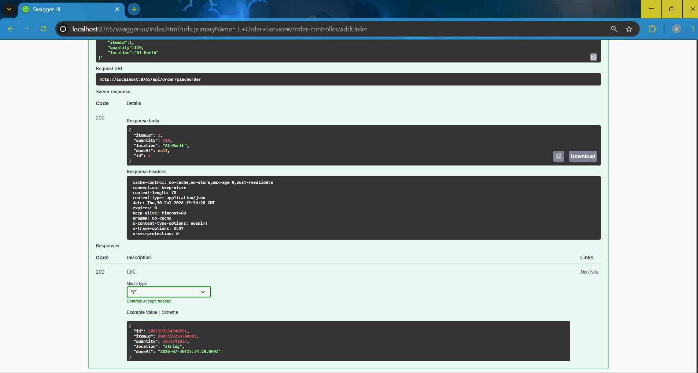

---

## 11. Kafka Notification

Notification Service consuming a low-stock event published by the Inventory Service via Apache Kafka.

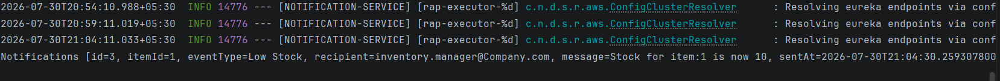


------------------------------------------------------------------------

# Running the Project

## Prerequisites

-   Java 17
-   Maven
-   MySQL
-   Apache Kafka

## Start Services

1.  Eureka Server
2.  Authentication Service
3.  Gateway Service
4.  Item Service
5.  Inventory Service
6.  Order Service
7.  Notification Service

Swagger:

    http://localhost:8765/swagger-ui/index.html

------------------------------------------------------------------------

# Configuration

Sensitive configuration files are intentionally excluded.

Use:

-   application-example.properties
-   application-example.yml

Rename them locally before running the application.

------------------------------------------------------------------------

# Testing

Implemented using:

-   JUnit 5
-   Mockito
-   Spring Boot Test

------------------------------------------------------------------------

# Future Improvements

-   Docker
-   Docker Compose
-   Kubernetes
-   Config Server
-   Redis Cache
-   Resilience4j
-   ELK Stack
-   CI/CD Pipeline

------------------------------------------------------------------------

# Author

**Aryan Raj**

Backend Developer | Java | Spring Boot | Microservices

GitHub: https://github.com/ARYAN01RAJ

LinkedIn: https://www.linkedin.com/in/aryan-raj-5111a2372/

------------------------------------------------------------------------

# License

MIT License.

